# Desafio CIMATEC

## Robôs Autônomos

Robôs autônomos são sistemas que podem operar em ambientes imprevisíveis e parcialmente desconhecidos, tendo a capacidade de realizar uma navegação ininterrupta e desviar de obstáculos. Os fundamentos da robótica móvel consistem em **locomoção**, **percepção** e **navegação**. O sistema de locomoção do robô está fortemente ligado à tarefa desempenhada e características como: estabilidade, condições do terreno, eficiência, influenciam nas escolhas de projeto. A especialização aliada a capacidade de se deslocar de forma autônoma torna crescente o interesse nestes sistemas para tarefas que podem ser difíceis para humanos. Características como tipos de atuadores e estratégia de deslocamento estão relacionadas a este sistema.
É bastante importante que robôs móveis sejam capazes de adquirir informação do seu ambiente, seja para identificar objetos próximos ou posicionamento relativo, pois caso esta tarefa não seja realizada de modo eficiente, a estimação de posição pode se tornar um problema. Este é o sistema de percepção e os elemento que possibilitam a detecção de localização, aquisição de dados  e mapeamento, são os sensores.
Enquanto o sistema de percepção está relacionado interação com ambiente próximo, os sistema de navegação compreende a tarefa de determinar a localização do robô, do seu objetivo e como este será alcançado. Geralmente o trajeto que deve ser seguido pelo robô não uma linha reta e isto faz com que técnicas sejam de planejamento de trajetória sejam utilizadas[[1]](https://doi.org/10.1109/ACCESS.2020.2975643).
Deste modo, o trabalho com robôs autônomos consiste em resolver os problemas de locomoção, percepção e navegação. Estes problemas consistem, de forma mais concreta, na determinação da geometria, estratégia de deslocamento, formas de sensoriamento, atuadores, estratégias de controle,  e planejamento de trajetória.

## Robôs de Tração Diferencial
Neste desafio foi escolhido um robô de tração diferencial, que se deslocará em um ambiente plano, de superfície lisa e com alguns obstáculos. Robôs com rodas são estáveis, de baixa complexidade topológica e de controle. Contudo, apesar da vantagem que um modelo matemático possibilita, este não é pôde ser facilmente obtido. Mesmo o emprego de técnicas de identificação levariam um tempo considerável.
Como o modelo completo era inviável, foi usada a estratégia de usar apenas o modelo cinemático e considerar que a estabilidade intrínseca e saturação de entrada evitasse instabilidade do controle em malha fechada. Deste modo, ao usar o modelo
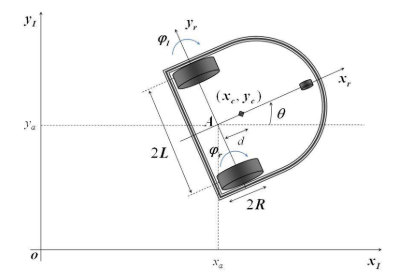

Colocar a equação em forma de imagem. O navegador não compilou a matriz.
$$
\dot{x}_a^r \dot{y}_a^r \dot{\theta} = \frac{R}{2} \dot{\phi}_R \dot{\phi}_L,
$$

que pode ser obtido por meio das restrições não-holonômicas e da matriz de transformação, obtem-se o modelo cinemático. A matriz em questão associa as referências inercial e de centro de massa do robô. Os estados $$x_a^r$$, $$y_a^r$$ e $$\theta$$ são as posições do robô com relação à referência inercial e o ângulo entre o vetor direção do robô e o eixo das abscissas. A entradas $$ \dot{\phi}_R$$ e $$ \dot{\phi}_L$$ são as velocidades angulares das rodas direita e esquerda, respectivamente[[2]](http://dx.doi.org/10.4172/2168-9695.1000107). Este modelo corresponde a imagem

colocar imagem do rodo

Como podemos observar no modelo, entradas de mesmo valor absoluto e sinais distintos provocam variação apenas em teta. Caso as entradas tenham mesmo valor, o robô se desloca em linha reta. Composições destes dois padrões provocam trajetórias curvas. Pode-se utlizar este comportamento para sintonizar uma realimentação proporcional, que pode ser testada previamente por meio de simulação. O repositório ??? contem códigos em MATLAB e também de simulações que utilizam o este modelo dinâmico.

## Etapas de solução do problema

O roteiro de projeto foi:
1. Escolher e implementar uma estratégia de planejamento de trajetória;
2. Testar modelo cinemático.
3. Projetar um controlador para o modelo cinemático que siga a trajetória do planejador;
4. Escolher sensores e implementar códigos;
5. Implementar uma estratégia de evasão de obstáculos.

## Planejamento de Trajetória
A etapa de planejamento de trajetória é importante devido à potencial redução tempo para execução da tarefa, bem como à diminuição de capital investido no robô móvel. Em um planejamento global, aquele que possui conhecimento de todo ambiente, os seguintes passo devem ser genericamente seguidos: modelagem do ambiente, definição de critério de otimização, seleção do algoritmo de busca. A modelagem é realizada ao se basear em um dado mapa, que é transformado em informação a ser armazenada de maneira conveniente. Quanto aos critérios, esses podem se basear em métricas relacionadas da menor distância, gasto de energia, segurança, etc. Já a busca consiste em achar o caminho entre pontos, que deve respeitar aos critérios de otimização e evitar colisões. Vários estratégias podem ser encontradas na literatura, com suas vantagens e deficiências. Contudo, aqui será a adotado método heurístico A* com modelo baseado em imagem segmentada por uma malhada de quadrados iguais. A métrica utilizada será a distância mínima. Mesmo com o aumento de complexidade com a variação de ordem do problema, este estratégia é atrativa devido a sua simplicidade e ao reduzido tamanho do ambiente de busca do desafio.[[3]](https://doi.org/10.3390/sym10100450) Com o algoritmo A* em mapa do ambiente foi conseguido resultado da seguinte imagem. Onde os pixels em preto representam obstáculos e paredes  alinha em vermelho a trajetória encontrada.

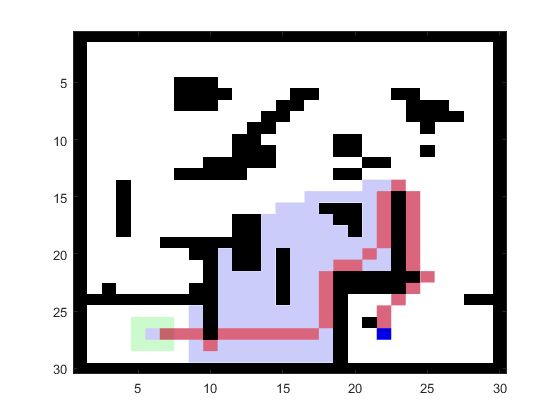

## Atuadores
Os atuadores utilizados são motores rotativos acoplados ao corpo do robô, que permitem a mudança direção e o deslocamento do mesmo. Felizmente esses motores já possuem um controle PID que está sintonizado de modo que a sua dinâmica de malha fechada possa ser desconsiderada. É assumido, como aproximação, que ao aplicar um sinal de referência para velocidade angular das rodas assumam esta velocidade instantaneamente.

## Sensores
No contexto do desafio os objetivos do sensoriamento são identificar obstáculos e o posicionamento do robô. Para o posicionamento, algumas técnicas foram escolhidas visando a simplicidade e economia na quantidade de dispositivos. A mais simples e econômica delas seria utilizar odometria, já que existem sensores de posição nas rodas do robô e o chão não apresenta rugosidade. Contudo, a incerteza acumulada ao longo do trajeto torna aplicação inviável. Isto pode ter ocorrido devido boa representação da física no simulador, que incluem não linearidades como derrapagem, por exemplo. Outra opção seria a utlização de acelerômetro juntamente com giroscópio e obter os estados de posição e direção por meio de integrações trapezoidais. Neste caso, os erros  numéricos relacionados, tipicos de cenários simulados, são integrados e acumulados ao longo do tempo. Para evitar divergência nos estados alguma técnica de filtragem deveria ser utilizada. Vale ressaltar que técinicas como fusão de sensores e filtragem ótima ajudariam bastante nestes cenário, mas a janela de tempo disponível foi insuficiente.
Como **solução adotada** foi utilizada uma unidade de medição inercial e trilateração, por meio do GPS. A unidade de medição inercial faz todo o trabalho de medição e fusão de medidas e apresenta as posições angulares do robô. Já trilateração por meio do GPS, embora tenha precisão insuficiente no mundo real e precise ser associada com outros tipos de medida, apresenta boa precisão no simulador.

## Controle Proporcional

Como dito na [seção](## Robôs de Tração Diferencial) anterior, a influência dos sinais de entrada, velocidades das rodas, no modelo cinemático podem ser utilizado para sintetizar um controle. Contudo, inicialmente é necessário quantificar o quanto o robô se diferencia de uma dada referência. Seja os estados do robô dada por

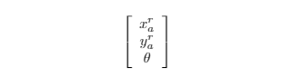

o erro entre a posição atual e o objetivo pode ser descrito por

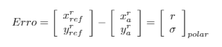

onde minimizar esta diferença consiste em atingir o ponto desejado. Percebe-se que o vetor de erro pode ser representado em coordenadas polares e que o objetivo pode ser atingido quando o módulo r tende a zero e teta tende a sigma. Portanto, pode-se reformular o erro da seguinte forma

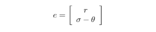

onde minimizar os componentes de e significa atingir a posição de referência. Entretanto, é necessário elaborar uma forma de interferir no sistema por meio suas entradas. Considere que o robô está direcionado ao seu objetivo e basta que este se desloque em linha reta. O sinal de controle para que ele cumpra esta tarefa pode ser

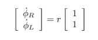

Caso o robô não esteja alinhado, basta que este rotacione no sentido de reduzir o seu erro de direção. Portanto o sinal de controle utilizado será

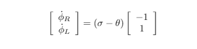

Pode-se então utilizar uma combinação linear como esforço de controle, que resulta

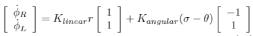

onde os K's são os ganhos linear e angular, selecionados de acordo com a prioridade de movimentação. O diagrama de blocos deste arranjo, controlador mais modelo cinemático, é apresentado da seguinte forma

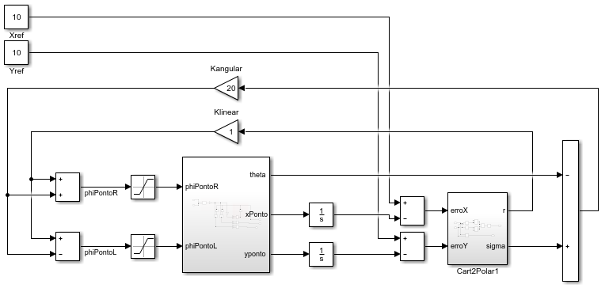

### Simulações

Utilizando [esta ideia de controle](## Controle Proporcional)  em conjunto com o [planejamento de trajetória](## Planejamento de Trajetória) foram realizadas simulações em MATLAB e Python. Os resultados destas podem ser vistas nas seguinte imagens. Os códigos relacionados estão no repositório de [simulações](scr/simulation).

#### MATLAB

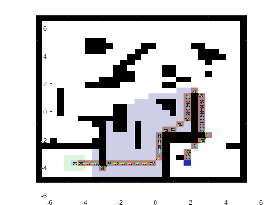

#### Python

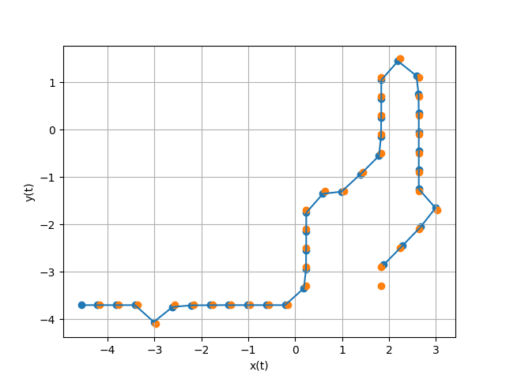

Embora o planejador tenha seguido a trajetória, na prática os pontos ficaram muito próximo das paredes, situação que dificultou o trajeto. Deste modo,  restrições quanto a proximidade de obstáculos devem ser inseridas no A*. Feito pequenos ajuste é esperado que a navegação leve ao resultado esperado.

Como alternativa foi definido uma trajetória qualquer que levasse o robô ao seu objetivo, representada em uma sequencias de pares ordenados em um arquivo .csv.

## Desvio de Obstáculos

O desvio de obstáculo utilizou a ideia de campos magnéticos, onde a interação entre dois vetores, um formado pela orientação do robô e outro pelo vetor do sensor, gera um momento virtual que é transformado em esforço de controle. A ideia é ilustrada pela seguinte imagem:

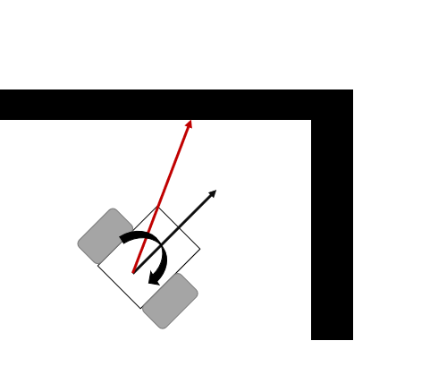

A torção virtual que será utilizada no controle é resultado do produto vetorial entre um versor com origem no centro de massa e outro em função do ângulo de montagem do sensor e da distância entre o robô e o obstáculo. Esta operação acontece apenas para um raio de alcance limitado e possui a seguinte equação

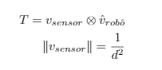

onde T é um vetor de torção e o módulo do vetor do sensor é calculado seguindo a ideia de campo potencial. O código desta estratégia foi implementado da seguinte função:

~~~python
def calculateAvoidanceRotation(robotDirection,sensorList,numberList,radius):
    rot = 0
    for sensor,sensorNumber in zip(sensorList,numberList):
        if sensor.getValue()<radius:
            vref = ObstacleAvoidance.makePotentialVector(sensorNumber,sensor.getValue())
            rot = rot + ObstacleAvoidance.calculateControlEffort(vref,robotDirection)
            return rot
~~~

onde o controlador percorre uma lista de sensores disponíveis, calculando e somando dos esforços de decorrentes dos produtos vetoriais. O esforço de controle é calculado utilizando a seguinte função:

~~~python
def calculateControlEffort(pontentialVector,robotDirection):
    rotation = numpy.cross(pontentialVector,robotDirection)
    return rotation[-1]
~~~

que pega o valor escalar decorrente do produto vetorial entre os vetores. Com a soma de todas as contribuições dos sensores o esforço de controle gerado é aplicado da mesma forma que o erro angular, gerando uma tendencial de mudança de direção no robô, de modo que este se afaste dos objetos no raio de atuação dos sensores.

#### Apresentação do Código de Controle

A primeira parte do algoritmo de controle consiste no carregamento da trajetória previamente definida.

~~~Python
#Load trajectory
trajectoryList = []
with open('trajetoria.csv',newline='') as csvfile:
    spamreader = csv.reader(csvfile,delimiter=',')
    for row in spamreader:
       trajectoryList.append(row)
newList = []
for l in trajectoryList:
    aux = [float(s) for s in l]
    newList.append(1*np.array(aux))

trajectoryList = newList
trajectoryList.reverse() #Make a stack
del(newList)
~~~

 Em seguida é inicializado o objeto da classe Robot() e demais sensores. Lembrando que foram utilizados 4 sensores ultrassônicos, uma IMU e um GPS.

Uma parte importante do código é a sintonia do controlador e restrições associados ao comportamento do mesmo. Antes do loop de controle foi assumido os ganhos de acordo com o código apresentado. 

~~~Python
#The Control Loop
#Tuning of Controller
atReference =False
angleGain = 1000
positionGain = 10
referencePosition = trajectoryList.pop()
robotDirection = oav.makeRobotDirectionVector()

interruptionCounter = 0
radius = 400
~~~

A variável interruptionCounter é utilizada com a ideia de histerese ou inércia e faz com que haja um prolongamento do algoritmo de desvio de obstáculo. Deste modo, este algoritmo ganha prioridade durante um tempo, já que sistema precisa de um tempo para mudar a sua dinâmica.

O ciclo do loop consistem em sensoriamento, cálculo de referências, cálculo do esforço de controle e atuação. Na primeira etapa os sensores existente são utilizados para realizar as medições necessárias.

~~~python
   # #Sensoring
    xyz = gpsSensor.getValues()
    rotation =inercialSensor.getRollPitchYaw()

    sensorList = [so0,so2,so5,so7]
    numberList = [0,2,5,7]

    #Data manipulation
    states = np.array([xyz[xyz_Zposition],xyz[xyz_Xposition],rotation[zRotation]])
   
~~~

Como o sistema muda no tempo é necessário a atualização de referências, o que é feito na seguinte parte:

~~~ Python
# #Setting reference
    endOfTrajectory = len(trajectoryList)<=0
    if not endOfTrajectory:
        if atReference:
            referencePosition = trajectoryList.pop()
        atReference = all( abs(states[0:2]-referencePosition)< 0.15)#10
    else:
        angleGain = 0
        positionGain = 0
~~~

Depois são calculados, seguindo as estratégias de realimentação proporcional e de campos magnéticos, os esforços de controle.  É aplicada saturação do sinal de entrada de velocidade, no intuito de deixar o controle menos agressivo.

~~~python
    #Calculating Control Effort
    avoidanteRotation = oav.calculateAvoidanceRotation(robotDirection,sensorList,numberList,radius)
    
    if abs(avoidanteRotation) >0:
        aux = avoidanteRotation
        interruptionCounter = 10
        
    if interruptionCounter > 0:
        interruptionCounter = interruptionCounter -1
        magnitude,direction = pControl.calculatePolarError(states,referencePosition)
        control = pControl.calculateKinematicControl(magnitude,100*aux/1000,10*angleGain,angleGain)
    else:
        magnitude,direction = pControl.calculatePolarError(states,referencePosition)
        control = pControl.calculateKinematicControl(magnitude,direction,positionGain,angleGain)
    #Effort limitation
    maxControl = np.max(abs(control))
    if (not maxControl == 0):
        control = MAX_VEL*control/maxControl
    control = pControl.saturateControl(control,MAX_VEL)
~~~

Finalmente as entrada de velocidade são aplicadas ao sistema.

~~~python
 #Set Reference Wheel Velocity
    if endOfTrajectory:
        leftMotor.setVelocity(0)
        rightMotor.setVelocity(0)
    else:
        leftMotor.setVelocity(control[1])
        rightMotor.setVelocity(control[0])
~~~

## Considerações finais

A estratégia utilizada para cumprir este desafio foi aplicar realimentação de estados proporcional juntamente com a ideia de interação entre campos magnéticos, para fazer o o robô seguir uma trajetória predefinida e evitar, em caráter local, obstáculos que possam atrapalhar a missão. Foram utilizados, além de 4 sensores de distância presentes no robô, mais sensores para posicionamento. Como resultado, como pode ser reproduzido no código presente, houve a conclusão da tarefa em algo próximo de 30 segundos.